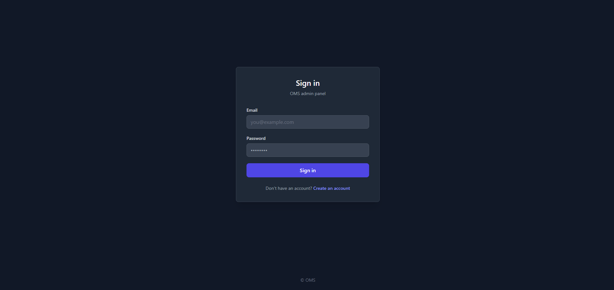
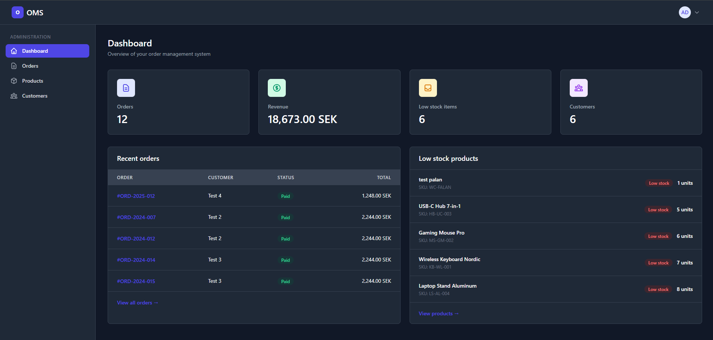
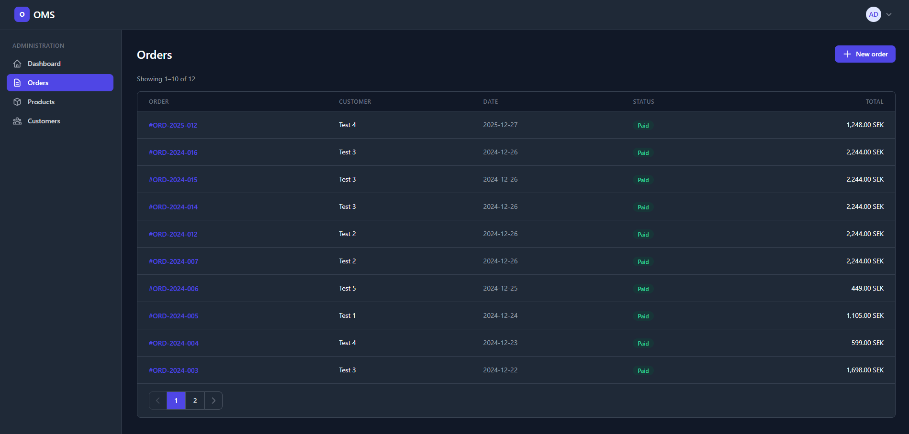
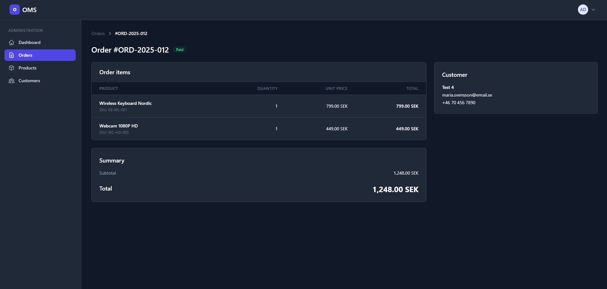
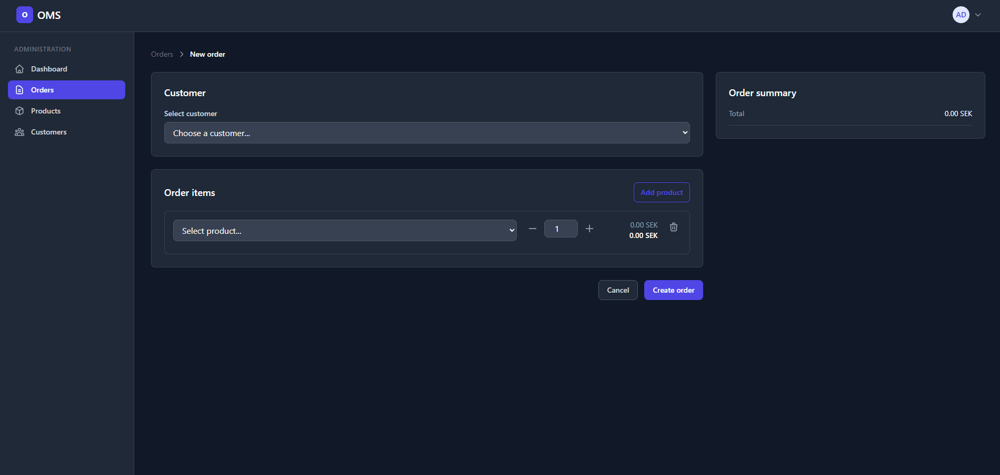
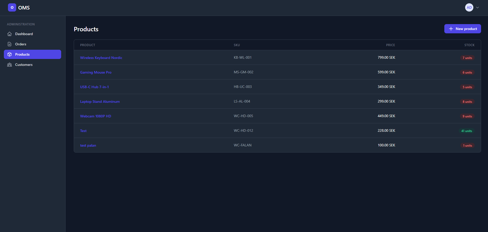
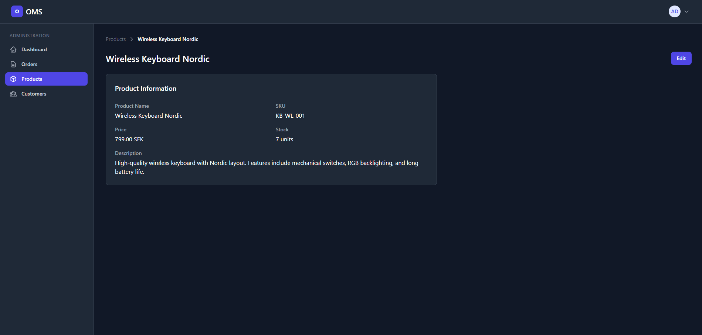
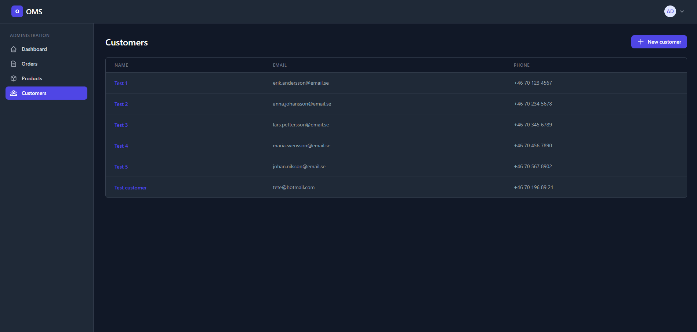
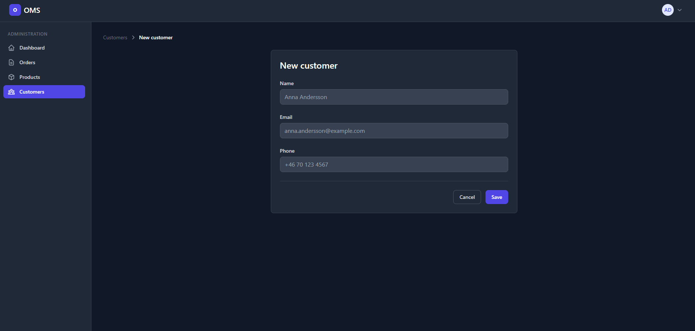
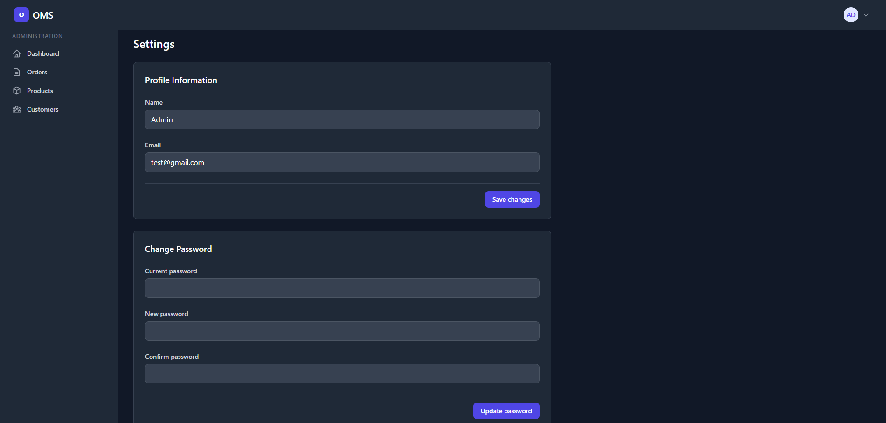

# OMS – Order Management System (PHP + MySQL + TailwindCSS)

A fully functional **Order Management System** built with **pure PHP**, **MySQL**, and **TailwindCSS** — designed as a **portfolio project** to demonstrate backend logic, authentication flow, session handling, CRUD operations, and secure database interaction without frameworks.

This application includes a complete admin interface for managing **products, customers, and orders**, with authentication, profile management, and a clean modern UI.

---

## Tech Stack

### Backend  


### Frontend  


---

## Project Overview

This system implements a complete order workflow:

- User authentication (register/login/logout)
- Admin dashboard with statistics
- CRUD modules for **Products / Customers / Orders**
- Inline editing & detail pages
- Profile & password management

The goal is to replicate how real admin systems work, including validation, data handling, security, and good code structure.

---

## Core Features

### Authentication System
- Register + Login using **PHP sessions**
- Password hashing using `PASSWORD_BCRYPT`
- Email validation & unique constraints
- Access control for admin pages

### Product Management
- Create and edit products  
- SKU, stock, price & description fields  
- Inline editing on product detail pages

### Orders Management
- Create orders by selecting customer & product  
- Auto price calculation
- Order listing with pagination & detail view

### Customer Management
- Add customers with name, email & phone  
- View + edit customer information  
- Connected with order system  

### Settings & Profile
- Update name + email
- Change password with old-password verification
- Validation

---

## Security Implementation

This project focuses heavily on secure PHP coding patterns:

| Security | Implementation |
|--------|----------------|
| Password Protection | `password_hash()` & `password_verify()` |
| SQL Injection Prevention | **Prepared statements everywhere** |
| XSS Protection | `htmlspecialchars()` output encoding |
| Session Security | Private auth routes + logout handling |
| Input Validation | Email format, empty field checks, sanitization |

---

## Project Structure

```
├── auth/ # Login / Register / Session handling
├── admin/ # Dashboard + CRUD modules
│ ├── products/
│ ├── customers/
│ └── orders/
├── public/assets/ # CSS / JS / Images
└── index.php # Entry → redirect to login
```

---

## Setup (Short)

1. Create database `phpproject` (Or you can edit auth/dbh.php)
2. Import tables (`users`, `products`, `customers`, `orders`) (database.sql file)
3. Update DB credentials in `auth/dbh.php`
4. Run project in any local PHP server (XAMPP/WAMP/MAMP)

---

## What this project demonstrates

✔ Real authentication & session logic  
✔ Secure database interaction with prepared statements  
✔ CRUD patterns without frameworks  
✔ Structured PHP code organization  
✔ UI development with TailwindCSS  
✔ Full-stack skills suitable for production-style apps  

---

## Architecture & Design

- PHP procedural backend
- MySQL relational schema
- Server-side rendered pages
- Reusable validation and DB helper functions
- Separation between **auth**, **admin**, **modules**, **assets**

---

## Roadmap / Planned Enhancements

> (not implemented but considered for growth)

- Product images
- CSV/PDF export
- Real-time inventory tracking
- Advanced search + filters
- API endpoints for external integration

---

## Screenshots

### Login  


### Register  


### Dashboard  


### Profile Dropdown


### Orders


### Orders - Detail


### Orders - Create


### Products


### Products - Detail


### Products - Edit


### Products - Create


### Customers


### Customers - Detail


### Customers - Edit


### Customers - Create


### Settings

